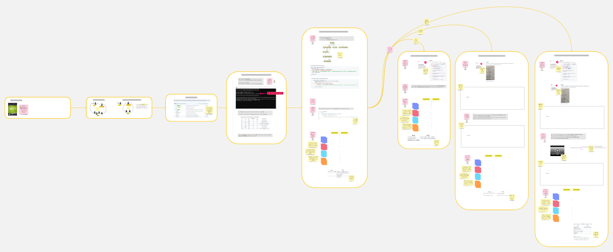

# Remote Facilitation

*[Image Source](https://pixabay.com/fr/photos/l-homme-ordinateur-portable-travail-4749237/)*

These facilitation advices will work for a large audience of remote attendees.

## Introduction message

In a remote configuration, the introduction message is really important as it is the only time you have with everyone before they go one to work, for most of the workshop, in their mob sessions. Here are the main topics to mention:

- Welcome
- Story of adding a bug in legacy
- Start the story behind the workshop: "You are programmers working in an international online book store. You have a piece of software that is responsible for building reports about invoices and taxes. You just discovered that the report was wrong. After some investigation, you found 2 bugs: taxes were not applied to invoices, and amounts were not converted to USD in the report. You just fixed the bugs (2 lines of code). You are about to start to add a test around these bugs."
- Your mission during the workshop: add the tests
- How the workshop will be run:
  - Code retreat: fixing same problem multiple times with different techniques (arbitrary constraints)
  - Strict timeboxing for 2h, learning > finishing!
  - 2 iterations of code retreat, 35m instead of 45m
  - 1st iteration will be using no technique
  - 2nd iteration will be able to chose your constraint
  - Retrospect at the end of each
  - You'll be working in mobs
  - You will have to self-organize as you want, but stick to a unique driver
  - We strongly advise you to have a timekeeper in the mob
  - The workshop is as self-guided as we could make it, don't wait for us
  - Remember, learning > finishing, stop the 1st iteration when we say so to be able to tackle the 2nd and learn new techniques
  - We'll gather at the end to share takeaways
- Technically:
  - Cameras on
  - You can use the main session chat to ask for help
  - We will be posting notification through the main session channel, so keep an eye on it, you'll get notifications about timings, troubleshooting, additional instructions...
  - We'll use online timers
  - [Miro]
    - We'll be using the 'bring everyone to me' to get you back all together at the end
    - We tried our best to make the board self-explanatory, but the markdown files in the repo go in more details if you are stuck
- We'll be jumping from mobs to mobs
- Present the goals of the 2 techniques quickly
- Mention that combining both is a case of 1+1>2
- Start the Mob self-organization activity

## Training from the Back of the Room activities

Here is how you can adapt these activities for remote facilitation

### Icebreaker question energizer

People will need to mob for programming, so it's a good thing to get them to know each other a bit more with an energizer. Team building icebreaker questions make perfect remote energizer. [This page](https://knowyourteam.com/blog/2018/01/08/the-25-best-icebreaker-questions-for-team-building-at-work/) contains 25 great questions.

### Self-study material

The material contains instructions, videos, and web centers. The goal is to have everyone, in any mob, be able to discover and learn the material at his own pace.

### Web centers

This collection of markdown files contains 2 'Web Centers':
* [Test Data Builders](./references/Test_Data_Builders.md)
* [The Mikado Method](./references/The_Mikado_Method.md)

These are web pages where attendees can look for clues as to how to get through the exercise.

If participants want to go deeper, they might also have a look at the [References](./references/References.md) page. 

### Mob programming

Mob programming is the simplest setup for a remote audience: use a unique driver and round-robin navigators. With this setup, only one person in the mob requires a working environment.

### Mini-Retros

Mini retros start with a simple question like "What worked well and what did not". In a remote setup, having an online board like Miro or Trello will help a lot. Here is what happens within each mob:

- Every mobster takes a few minutes to answer the questions, and fill the good / bad columns
- They react and discuss the tickets
- They can also have a look at the typical answers and at other insightful questions from the [Retrospective Guide](Retrospectives_Guide.md)
- Discussion can continue until the time is over

### Takeaways as a Conclusion

A good way to conclude the workshop is to bring everyone together again, and ask them for main takeaways from everything they did. Again, an online board will help a lot. Here is how you can run this:

- Ask every mob to pick 1 key takeaway, and put them in the global takeaway board
- Bring everyone together in the main session
- Round rob through the mobs

## Tool

Obviously, remote facilitation depends heavily on good tools. Here are the typical features that your tooling system should provide for a smooth workshop:

- [PRESENTATION] Video conference, where you can present to the whole audience
- [BREAKOUT] Video conference in breakout rooms, one for each mobs
- [SCREEN] Screen sharing, while you or the drivers present
- [JUMP] Quickly jump from one breakout room to the other
- [GRAPH] Mobs will need a shared tool to draw a mikado graph, like a mind map for example
- [RETRO] Run Retrospectives
- [HELP] Mobs will need to ask for help if they are blocked
- [NOTIFICATIONS] A chat system to share notifications and messages
- [COME-BACK] Send a 'blocking' message that attendees must see (Ex: when they should get back from mob to all-in work)
- [TIMER] Shared timers in order to cadence the mobs' work
- [MAP] It is nice to have a visual map of the path in the workshop

Here are best-practices for the different tools

### Miro tips [MAP] [GRAPH] [RETRO] [COME-BACK] [TIMER] [BREAKOUT]

Miro can deal with almost all the above points except Video conferencing. It's simpler to use a single board for all the audience, and to duplicate working zones for each mob. It's dead easy to setup retrospectives, energizers, and mind-maps in Miro.

#### Use an online board [MAP]

Nick Tune provides great advices about how to run effective workshops with Miro in [this post](https://medium.com/nick-tune-tech-strategy-blog/organising-large-miro-boards-for-remote-workshops-abcf01bc2d8e).

#### Use online timers [TIMER]

Miro has a built-in shared timer agenda. Here is how you can use it:

- You don't need to set a timer when you are facilitating or presenting, just make sure to stick within the timebox. Ex: General introduction
- Add a timer for short activities. Ex: self-organizing into groups
- Add a long timer encompassing coding activities that follow each other like. Ex: understand your constraint + coding

#### Get everyone's attention [COME-BACK]

One rather intrusive way, but effective, way to get everyone's attention, and for example, to bring everyone back in the general session for the final retrospective, is to use Miro's 'Bring Every One to me'

#### Draw the breakout rooms on the board [BREAKOUT]

Miro can be very effective to build a self-organized breakout activity. You can also provide a link to the breakout room in your video conferencing system so that mobsters can easily jump in.

### General chat system tips

#### The main session chat [NOTIFICATIONS] [HELP]

Before mobs spread in their own sessions, tell them to keep their chat open on the main session. This will allow them to post requests for help on this chat, but it will also allow you to send general notifications to all the audience.

### [hopin.to](https://hopin.to) tips [PRESENTATION] [BREAKOUT] [SCREEN] [JUMP] [HELP] [NOTIFICATIONS]

Hopin.to is an remote openspace system. It features video conferencing, screensharing, breakout rooms and a chat system. It fits almost all our needs out of the box.

### Microsoft Teams tips [PRESENTATION] [BREAKOUT] [SCREEN] [JUMP] [HELP] [NOTIFICATIONS]

Teams is a team chat system. It features video conferencing, screensharing, breakout rooms, multiple channels and a chat system. It fits almost all our needsl but needs a bit of customization.

#### Create a new Teams for your event [BREAKOUT]

Teams features breakout rooms, unfortunately, only the organizer is allowed to jump from one room to another, and you can only have a single organizer per meeting!

If you are the only organizer, then everything is fine, just use a meeting and create breakout rooms as people have self-organized

If you are many organizers, the situation becomes a lot more involved. Here is what you can do:
- Create a new team in MS Teams for the event
- Make your attendees members of this team
- Schedule a video conf event on the general channel for your event
- Use the link to this event to let people join (invite, learning system, Miro board...)
- Create as many new 'mob' channels as you envision, you can simply name them mob-1, mob-2...
- Schedule other video conf events on these sub-channels at the same time
- Again, copy the links to these event to let mobsters join them

#### Extra channels [NOTIFICATIONS] [HELP]

If you created a dedicated team for your event, you have the possibility to create new channels for help, notifications, organizers...

You can also use @your-ms-team to send notifications to everyone.